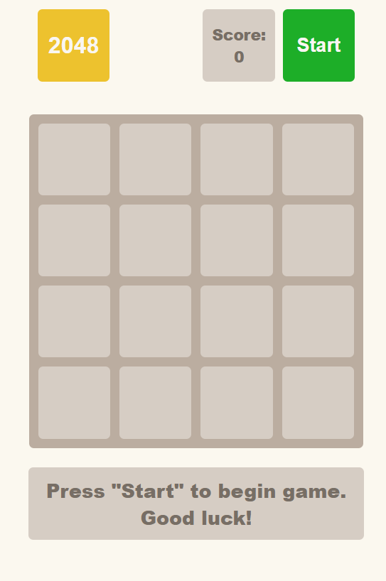

# [2048 Game](https://fetrw.github.io/2048_game/)

> ## 🟦 Overview
> This is a classic 2048 game implemented using JavaScript. The game allows users to play using keyboard arrow keys. The game can be started and restarted using a button on the UI.

> ## ✨ Features
> - **🎮 Interactive Gameplay:** Use arrow keys to move tiles and merge them to achieve a score of 2048.
> - **📈 Dynamic Scoring:** Score updates in real-time as tiles are merged.
> - **📝 Game Status Messages:** Displays win, lose, or start messages based on the game state.

> ## 🛠️ Technologies Used
> - **💻 JavaScript:** Game logic and interactivity.
> - **🌐 HTML5:** Structure and layout of the game interface.
> - **🎨 SCSS:** Styling of game elements.

> ## 🚀 How It Works
> - **Game Initialization:** The game starts with an empty 4x4 grid and two random tiles.
> - **Player Moves:** Use arrow keys to move tiles in the desired direction. Tiles merge when they have the same value.
> - **Game Status:** The game ends when there are no valid moves left or when the tile 2048 is achieved.

> ## 📂 File Structure
> - `index.html` - The main HTML file that includes the game interface.
> - `main.scss` - The CSS file for styling the game.
> - `main.js` - Contains the JavaScript code for game logic and UI updates.
> - `Game.class.js` - JavaScript class that handles game logic and state management.

> ## 🧩 Game Class Overview
> The `Game` class is responsible for:
> - Managing game state and score.
> - Handling player moves.
> - Adding new tiles to the board.
> - Checking game status (win or lose).

> ## 🌐 Live Demo
> Play the game live at [Game Demo](https://fetrw.github.io/2048_game/).

> ## 🖼️ Screenshots
> 
> 
> This screenshot shows the game in progress, with tiles merging and scores updating in real-time. The game board layout and tile colors reflect the current state of the game.
> 
> 
> 
> This screenshot displays the starting page of the game. It shows the initial layout and provides a clear view of the game interface before any moves are made.
